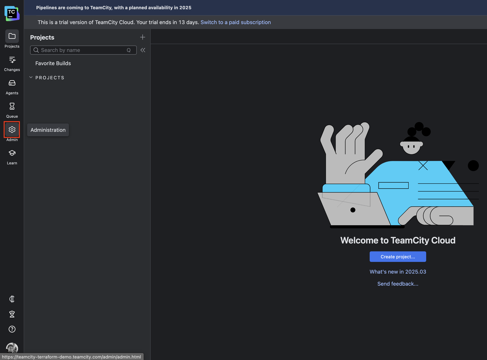
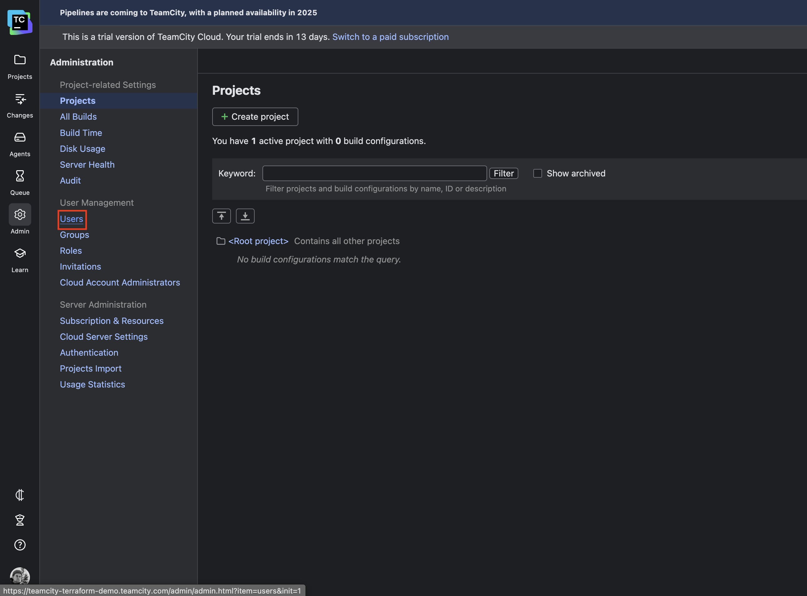
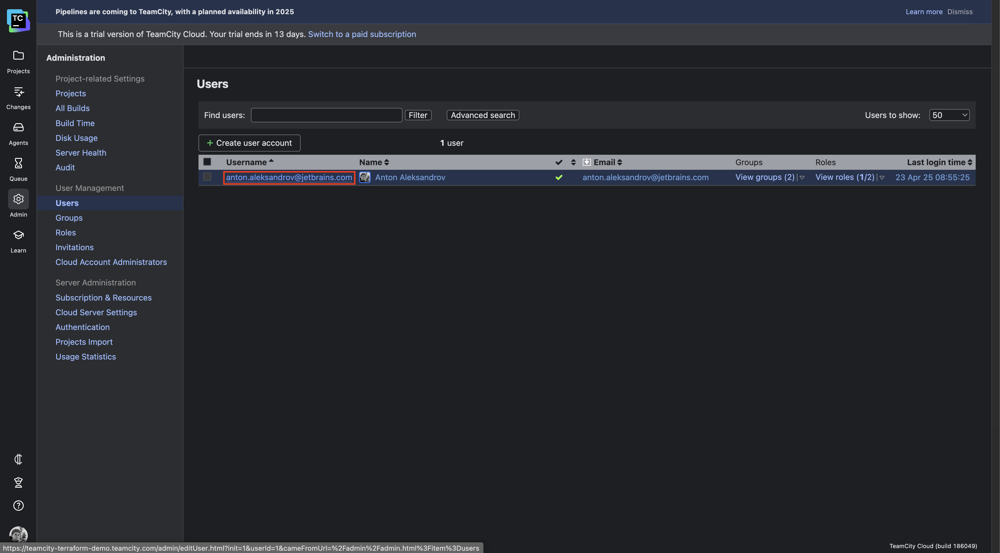
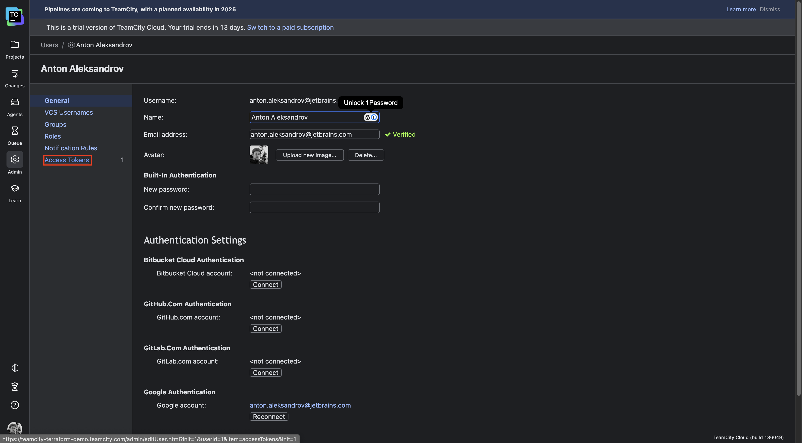
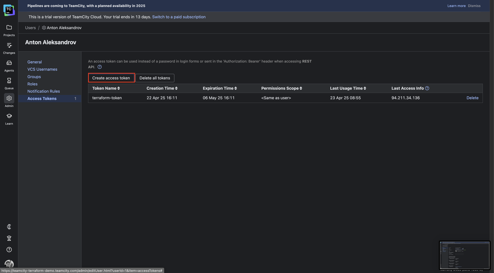
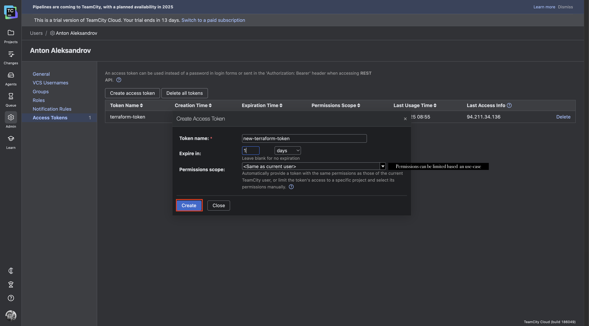
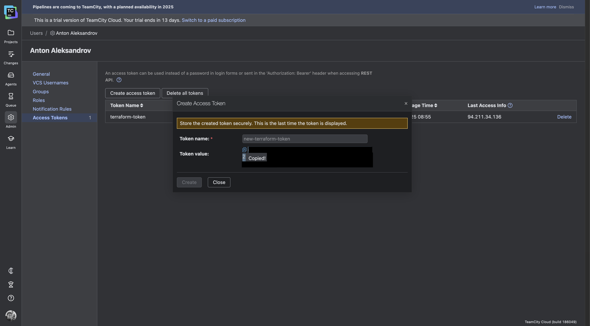

# Configuring TeamCity Using the Terraform Provider for TeamCity

This document explains how to configure **TeamCity** using [the official Terraform provider for TeamCity](https://github.com/JetBrains/terraform-provider-teamcity).

---

## Prerequisites

Before configuring TeamCity, ensure the following prerequisites are met:

1. **Terraform Installed:** Terraform must be installed locally.
2. **TeamCity Server:** A running instance of TeamCity, either in [TeamCity Cloud](https://www.jetbrains.com/teamcity/cloud) or on-premises.
3. **Repository with Terraform Files:** The repository containing the Terraform configuration is cloned locally.

---

### Set Up an Access Token for the Terraform Provider

1. Log in to your TeamCity instance and navigate to the **Administration** page.  
   

2. Go to the **Users** page.  
   

3. Select your user.  
   

4. Click the **Access tokens** button.  
   

5. Create a new access token.  
   

6. Configure the token's TTL and permissions.  
   

7. Copy the token value.  
   

8. Create a file named `terraform.tfvars` in the cloned repository and add the following line:
   ```plaintext
   teamcity_token = "<COPIED_TOKEN>"
   ```

---

### Run Terraform

This Terraform configuration creates two projects in TeamCity: **Project A** and **Project B**. It links **Project A** to a GitHub repository using an SSH key for authentication and enables versioned settings for **Project A** to be managed directly from the repository. Additionally, UI editing for these settings is disabled, ensuring changes are tracked exclusively in the repository.

Start by initializing Terraform with the following command:

```shell
terraform init
```

The `terraform init` command sets up the working directory by downloading the required providers (such as the TeamCity provider), configuring the backend for state management, and preparing Terraform to execute the configuration.

Next, plan the resource creation with the following command:

```shell
terraform plan
```

The `terraform plan` command analyzes the configuration, compares it with the current state, and outputs a detailed list of actions Terraform would perform to create, update, or delete resources—without making any actual changes.

Finally, create the resources by running:

```shell
terraform apply
```

The `terraform apply` command executes the actions proposed by the plan, creating, updating, or deleting resources as specified in the configuration to achieve the desired state.

---

### What Happens on the Server?

While running the `terraform apply` command, you can monitor the changes on the TeamCity server. Two new projects, **Project A** and **Project B**, will be created. Additionally, **Project A** will have versioned settings enabled and will start applying the Kotlin DSL from the specified private repository.


---

### Clean Up

To run the clean-up process, execute the following command:

```shell
terraform destroy
```
The `terraform destroy` command deletes all resources defined in the current configuration by analyzing the state file and determining what needs to be removed. It prompts for confirmation before proceeding and ensures resources are destroyed systematically based on their dependencies.

Also don't forget to delete the access token used for tests.

